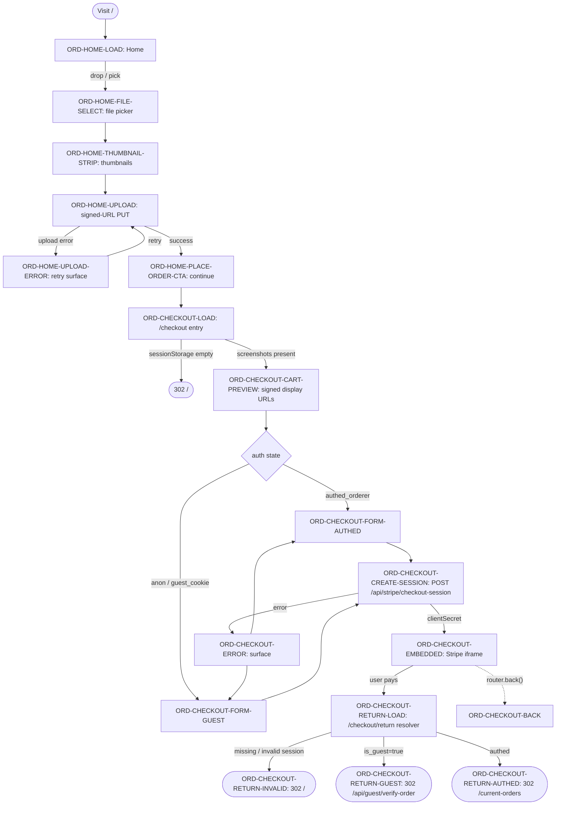
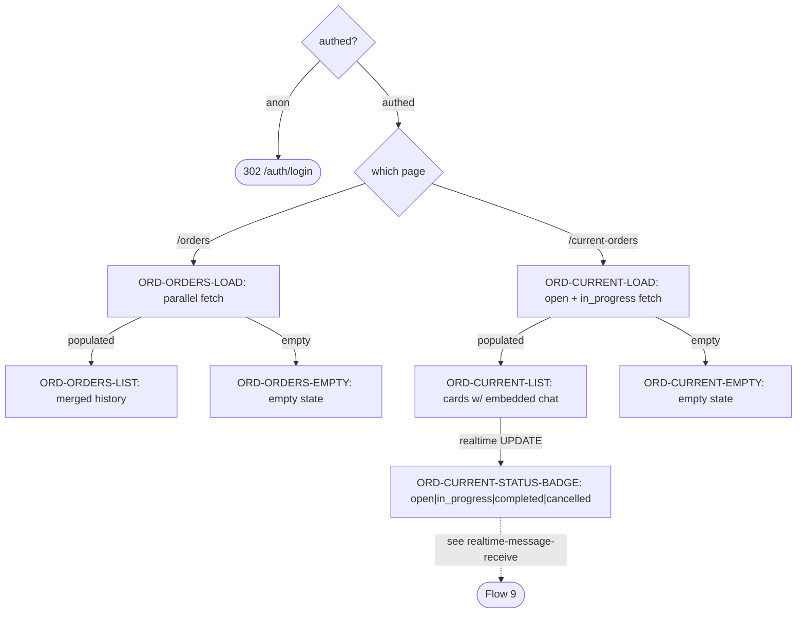
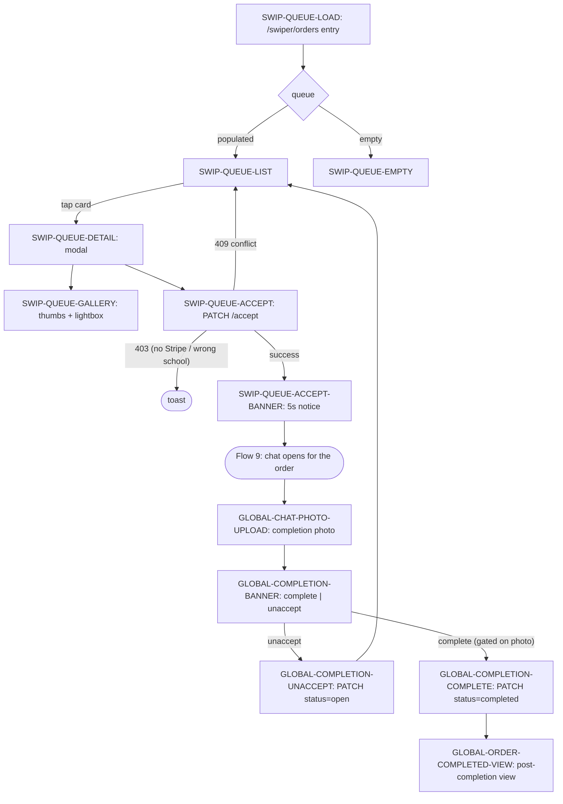
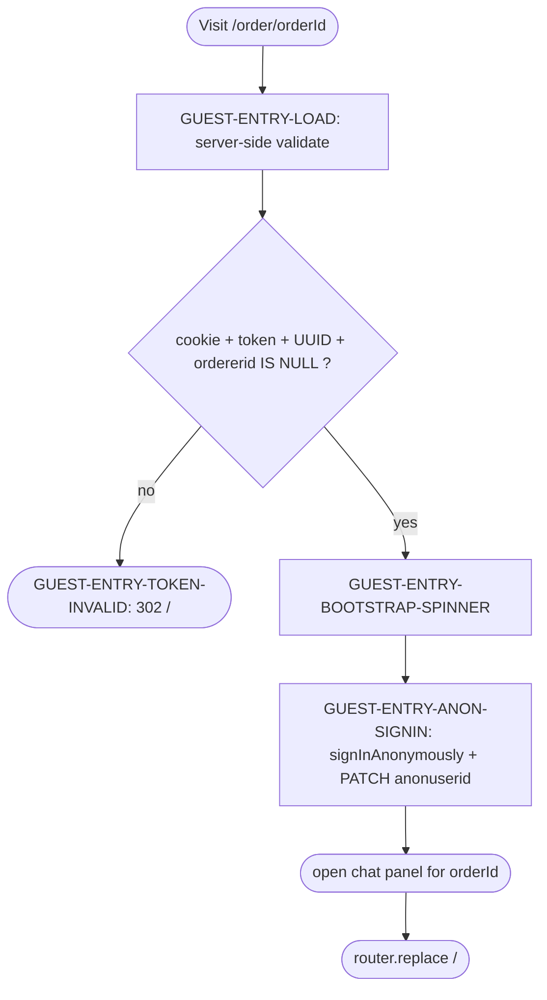
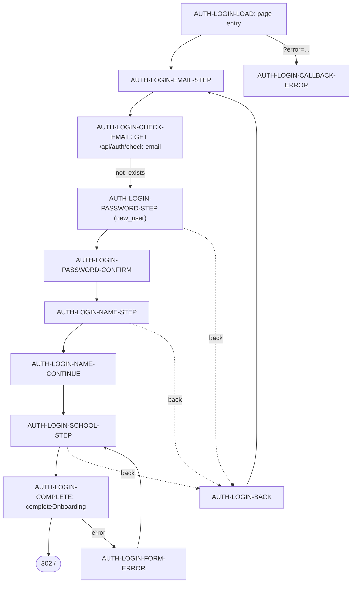
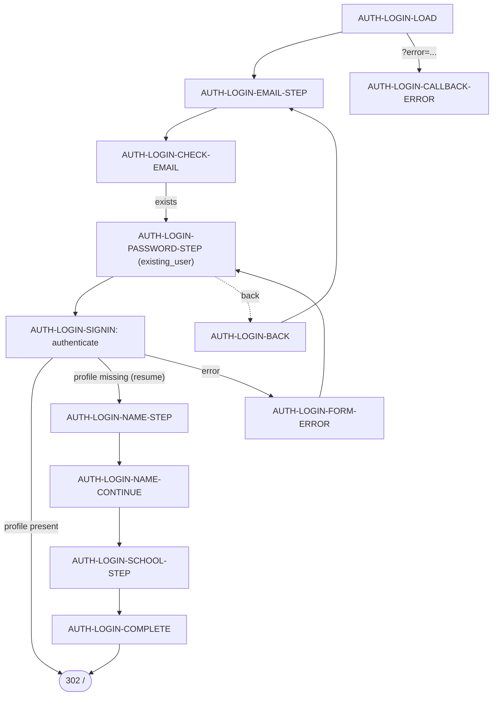
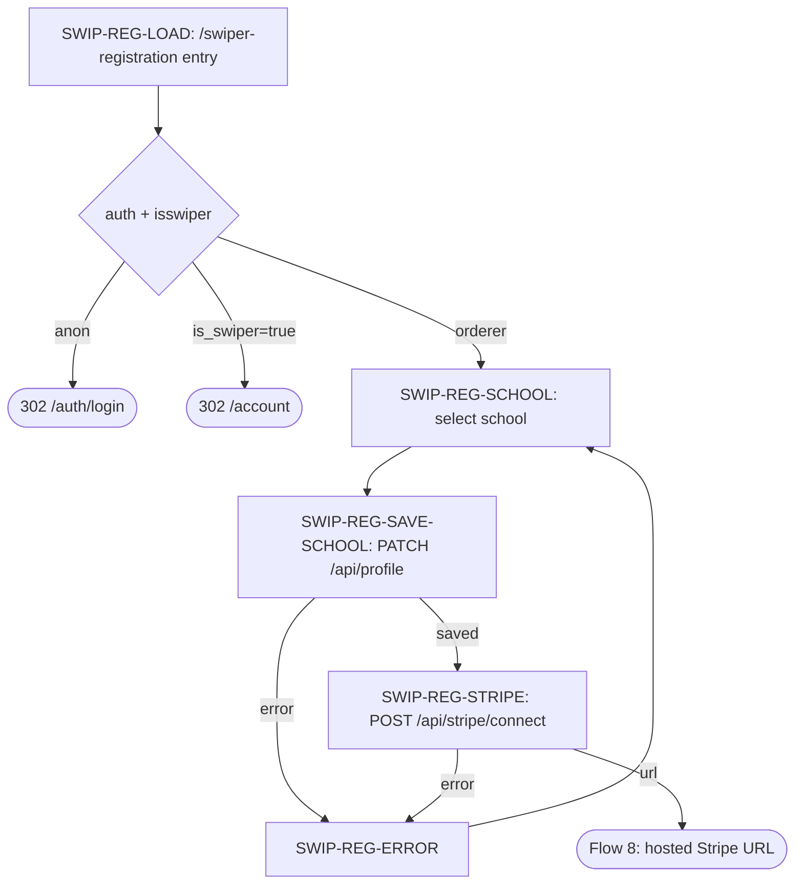
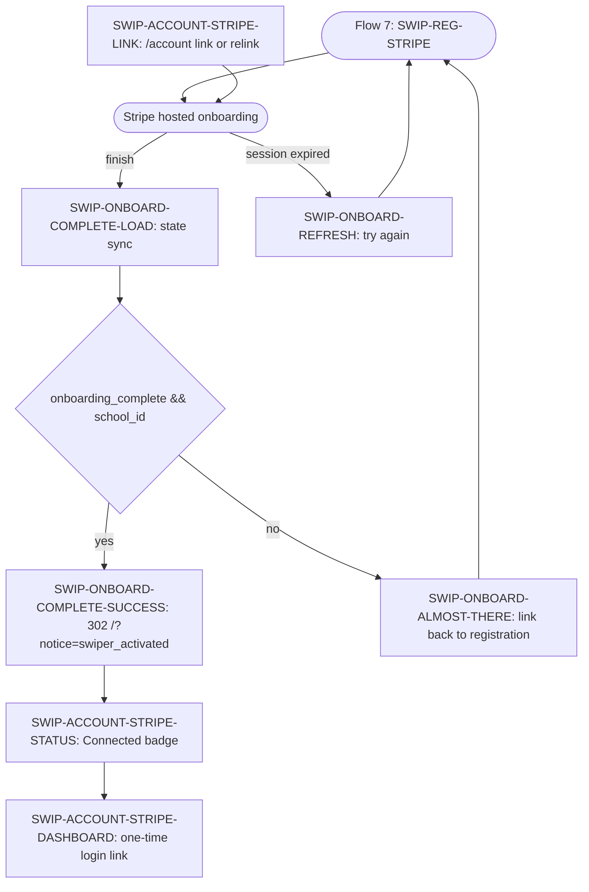
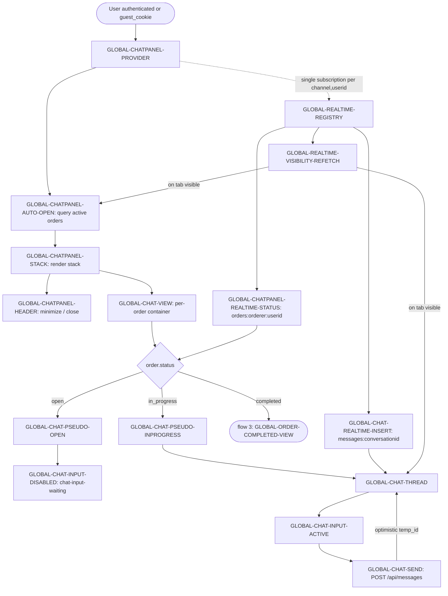

# Goober Eats Flows (Phase 1)

> Per-flow state diagrams keyed to the feature IDs in
> [`00-features.md`](./00-features.md). Produced in Session 02.

## Legend

- One H2 per flow. Each flow opens with a Mermaid `flowchart TD` whose nodes
  are labeled `[FEATURE_ID: short label]`.
- Diamond nodes (`{ }`) are decisions; rectangles (`[ ]`) are states /
  surfaces; rounded (`( )`) are terminal redirects.
- Edges carry the `state_branches` value from `00-features.md` when the
  branch maps to a UI transition (e.g. `-- submitting -->`); otherwise they
  carry a short verb.
- Each flow ends with a `| Flow node | Feature IDs | Covered? |` table. An
  ID may appear in multiple flow tables when the underlying surface is
  re-used across flows; the gate is "every ID appears in ≥1 flow table or
  in the non-flow section." (`Covered?` is `✅` when the ID is actually
  reachable from the diagram.)
- The bottom-of-file `## ID → flow matrix` is the authoritative coverage
  ledger. It lists all 107 IDs from `00-features.md` and the flow(s) /
  non-flow bucket that cover each.
- Auth-state branching follows the discriminated-union sketch in master plan
  §10 (`anon | authed_orderer | authed_swiper_pre_stripe | authed_swiper |
  guest_cookie`).

---

## Flow: orderer-place

The orderer assembles a cart-screenshot order, pays via embedded Stripe
Checkout, and lands back in the app. Auth (logged-in orderer) and guest
paths share this one diagram; divergence happens at form composition and
post-payment redirect.

| Flow node | Feature IDs | Covered? |
|-----------|-------------|----------|
| Home | ORD-HOME-LOAD | ✅ |
| file picker | ORD-HOME-FILE-SELECT | ✅ |
| thumbnails | ORD-HOME-THUMBNAIL-STRIP | ✅ |
| signed-URL PUT | ORD-HOME-UPLOAD | ✅ |
| retry surface | ORD-HOME-UPLOAD-ERROR | ✅ |
| continue | ORD-HOME-PLACE-ORDER-CTA | ✅ |
| /checkout entry | ORD-CHECKOUT-LOAD | ✅ |
| signed display URLs | ORD-CHECKOUT-CART-PREVIEW | ✅ |
| guest form | ORD-CHECKOUT-FORM-GUEST | ✅ |
| authed form | ORD-CHECKOUT-FORM-AUTHED | ✅ |
| create session | ORD-CHECKOUT-CREATE-SESSION | ✅ |
| Stripe iframe | ORD-CHECKOUT-EMBEDDED | ✅ |
| checkout error | ORD-CHECKOUT-ERROR | ✅ |
| router.back() | ORD-CHECKOUT-BACK | ✅ |
| return resolver | ORD-CHECKOUT-RETURN-LOAD | ✅ |
| guest redirect | ORD-CHECKOUT-RETURN-GUEST | ✅ |
| authed redirect | ORD-CHECKOUT-RETURN-AUTHED | ✅ |
| invalid redirect | ORD-CHECKOUT-RETURN-INVALID | ✅ |

---

## Flow: orderer-track

History (`/orders`) plus active list (`/current-orders`) with realtime
status badges. Authed-only (anon hits a redirect to `/auth/login`).

| Flow node | Feature IDs | Covered? |
|-----------|-------------|----------|
| /orders entry | ORD-ORDERS-LOAD | ✅ |
| merged history | ORD-ORDERS-LIST | ✅ |
| /orders empty | ORD-ORDERS-EMPTY | ✅ |
| /current-orders entry | ORD-CURRENT-LOAD | ✅ |
| active cards | ORD-CURRENT-LIST | ✅ |
| /current-orders empty | ORD-CURRENT-EMPTY | ✅ |
| status badge | ORD-CURRENT-STATUS-BADGE | ✅ |

---

## Flow: swiper-accept-complete

The swiper queue → accept → fulfill → completion-photo → mark complete OR
unaccept-back-to-queue loop. Money-moving — no optimistic transitions
(plan §10).

| Flow node | Feature IDs | Covered? |
|-----------|-------------|----------|
| queue entry | SWIP-QUEUE-LOAD | ✅ |
| populated queue | SWIP-QUEUE-LIST | ✅ |
| empty queue | SWIP-QUEUE-EMPTY | ✅ |
| order detail | SWIP-QUEUE-DETAIL | ✅ |
| screenshot gallery | SWIP-QUEUE-GALLERY | ✅ |
| accept action | SWIP-QUEUE-ACCEPT | ✅ |
| accept banner | SWIP-QUEUE-ACCEPT-BANNER | ✅ |
| photo upload | GLOBAL-CHAT-PHOTO-UPLOAD | ✅ |
| completion banner | GLOBAL-COMPLETION-BANNER | ✅ |
| mark complete | GLOBAL-COMPLETION-COMPLETE | ✅ |
| unaccept | GLOBAL-COMPLETION-UNACCEPT | ✅ |
| post-completion view | GLOBAL-ORDER-COMPLETED-VIEW | ✅ |

---

## Flow: guest-track

Guest-only entry into an existing order's chat. Triggered by the email link
the verify-order endpoint sets the cookie on, OR by the
`/checkout/return → /api/guest/verify-order` redirect from flow 1.

| Flow node | Feature IDs | Covered? |
|-----------|-------------|----------|
| validate | GUEST-ENTRY-LOAD | ✅ |
| invalid redirect | GUEST-ENTRY-TOKEN-INVALID | ✅ |
| bootstrap spinner | GUEST-ENTRY-BOOTSTRAP-SPINNER | ✅ |
| anon sign-in + association | GUEST-ENTRY-ANON-SIGNIN | ✅ |

---

## Flow: auth-signup-new

Email-not-found branch of `/auth/login`. Multi-step: email → password +
confirm → name → school → complete onboarding (server action creates
`profiles` row).

| Flow node | Feature IDs | Covered? |
|-----------|-------------|----------|
| page entry | AUTH-LOGIN-LOAD | ✅ |
| email step | AUTH-LOGIN-EMAIL-STEP | ✅ |
| check-email API | AUTH-LOGIN-CHECK-EMAIL | ✅ |
| password step | AUTH-LOGIN-PASSWORD-STEP | ✅ |
| password confirm | AUTH-LOGIN-PASSWORD-CONFIRM | ✅ |
| name step | AUTH-LOGIN-NAME-STEP | ✅ |
| name → school continue | AUTH-LOGIN-NAME-CONTINUE | ✅ |
| school step | AUTH-LOGIN-SCHOOL-STEP | ✅ |
| complete onboarding | AUTH-LOGIN-COMPLETE | ✅ |
| step-back | AUTH-LOGIN-BACK | ✅ |
| callback error banner | AUTH-LOGIN-CALLBACK-ERROR | ✅ |
| form-error banner | AUTH-LOGIN-FORM-ERROR | ✅ |

---

## Flow: auth-signin-existing

Email-found branch. Includes the **onboarding-resume** sub-branch: an
existing auth user without a profile row (interrupted signup) is routed
into name → school → complete after `signin` succeeds.

| Flow node | Feature IDs | Covered? |
|-----------|-------------|----------|
| page entry | AUTH-LOGIN-LOAD | ✅ |
| email step | AUTH-LOGIN-EMAIL-STEP | ✅ |
| check-email API | AUTH-LOGIN-CHECK-EMAIL | ✅ |
| password step | AUTH-LOGIN-PASSWORD-STEP | ✅ |
| sign-in submit | AUTH-LOGIN-SIGNIN | ✅ |
| resume name step | AUTH-LOGIN-NAME-STEP | ✅ |
| resume name continue | AUTH-LOGIN-NAME-CONTINUE | ✅ |
| resume school step | AUTH-LOGIN-SCHOOL-STEP | ✅ |
| resume complete | AUTH-LOGIN-COMPLETE | ✅ |
| step-back | AUTH-LOGIN-BACK | ✅ |
| callback error | AUTH-LOGIN-CALLBACK-ERROR | ✅ |
| form-error | AUTH-LOGIN-FORM-ERROR | ✅ |

> Shared with auth-signup-new: every node above except `AUTH-LOGIN-SIGNIN`
> appears in both flows. `AUTH-LOGIN-SIGNIN` is unique to this flow.
> `AUTH-LOGIN-PASSWORD-CONFIRM` is unique to auth-signup-new.

---

## Flow: swiper-register

`/swiper-registration` two-step form: school selection → continue to Stripe
Connect onboarding (which leads into the next flow). Stripe link creation
is the trigger; the actual onboarding lives in `stripe-connect-onboard`.

| Flow node | Feature IDs | Covered? |
|-----------|-------------|----------|
| page entry | SWIP-REG-LOAD | ✅ |
| school select | SWIP-REG-SCHOOL | ✅ |
| save school | SWIP-REG-SAVE-SCHOOL | ✅ |
| continue to Stripe | SWIP-REG-STRIPE | ✅ |
| error surface | SWIP-REG-ERROR | ✅ |

---

## Flow: stripe-connect-onboard

Two entry points (registration's Continue button and `/account`'s Stripe
Link). Stripe-hosted onboarding redirects to either
`/stripe/onboard/complete` (success) or `/stripe/onboard/refresh` (session
expired). The complete page reconciles state and either flips the user to
`is_swiper=true` or routes them back to the registration page.

| Flow node | Feature IDs | Covered? |
|-----------|-------------|----------|
| account link entry | SWIP-ACCOUNT-STRIPE-LINK | ✅ |
| onboard return resolver | SWIP-ONBOARD-COMPLETE-LOAD | ✅ |
| auto-activate + redirect | SWIP-ONBOARD-COMPLETE-SUCCESS | ✅ |
| almost-there fallback | SWIP-ONBOARD-ALMOST-THERE | ✅ |
| session-expired refresh | SWIP-ONBOARD-REFRESH | ✅ |
| status badge | SWIP-ACCOUNT-STRIPE-STATUS | ✅ |
| Stripe dashboard link | SWIP-ACCOUNT-STRIPE-DASHBOARD | ✅ |

> `SWIP-REG-STRIPE` is owned by Flow 7 (swiper-register) and referenced here
> as the registration entry point.

---

## Flow: realtime-message-receive

Unified chat lifecycle. Covers the three order statuses (open →
in_progress → completed), the realtime channel registry / visibility
refetch safeguards (Session 07 deliverables), and the per-status surface
(disabled input → active input → completed view). Drives the embedded
ChatView in `/current-orders`, the floating ChatPanel stack, and the chat
inside the guest-track flow.

| Flow node | Feature IDs | Covered? |
|-----------|-------------|----------|
| panel provider | GLOBAL-CHATPANEL-PROVIDER | ✅ |
| auto-open active orders | GLOBAL-CHATPANEL-AUTO-OPEN | ✅ |
| realtime status sub | GLOBAL-CHATPANEL-REALTIME-STATUS | ✅ |
| panel stack | GLOBAL-CHATPANEL-STACK | ✅ |
| panel header | GLOBAL-CHATPANEL-HEADER | ✅ |
| chat view | GLOBAL-CHAT-VIEW | ✅ |
| message thread | GLOBAL-CHAT-THREAD | ✅ |
| pseudo: open | GLOBAL-CHAT-PSEUDO-OPEN | ✅ |
| pseudo: in_progress | GLOBAL-CHAT-PSEUDO-INPROGRESS | ✅ |
| input: active | GLOBAL-CHAT-INPUT-ACTIVE | ✅ |
| input: disabled | GLOBAL-CHAT-INPUT-DISABLED | ✅ |
| send button | GLOBAL-CHAT-SEND | ✅ |
| realtime INSERT | GLOBAL-CHAT-REALTIME-INSERT | ✅ |
| channel registry | GLOBAL-REALTIME-REGISTRY | ✅ |
| visibility refetch | GLOBAL-REALTIME-VISIBILITY-REFETCH | ✅ |

> `GLOBAL-CHAT-PHOTO-UPLOAD` and `GLOBAL-ORDER-COMPLETED-VIEW` are owned by
> Flow 3 (swiper-accept-complete) and referenced here as terminal nodes.

---

## Non-flow capabilities

IDs whose behavior is static UI, shell chrome, helpers, or primitives — no
state diagram is meaningful. Each is reachable from at least one flow's
surface but doesn't participate in a state machine.

### Shell chrome (rendered by `app/layout.tsx`)

| ID | Title | Notes |
|----|-------|-------|
| GLOBAL-LAYOUT-ROOT | Root layout shell | Hosts every flow's surface. |
| GLOBAL-FONTS | Font loading via next/font | Static; Session 03 swap. |
| GLOBAL-SESSION-REFRESH | Supabase session refresh middleware | Frozen path; transparent. |
| GLOBAL-HEADER | Header navigation bar | Static container. |
| GLOBAL-HEADER-HOME | Home link | Static. |
| GLOBAL-HEADER-ORDERS | Orders link (authed) | Static. |
| GLOBAL-HEADER-CURRENT | Current-orders link (authed) | Static. |
| GLOBAL-HEADER-ACCOUNT | Account link (authed) | Static. |
| GLOBAL-HEADER-AUTH | Sign-in / sign-up links (anon) | Static. |
| GLOBAL-BANNER-BECOME | Become-a-Swiper banner | Static promo on `/`. |
| GLOBAL-BANNER-HIDDEN | Banner conditional null | Static; route-conditional. |
| GLOBAL-SWIPER-BUTTON | Floating swiper-orders button | Static; visible to swipers. |
| GLOBAL-SWIPER-BADGE | Pending-order badge count | Server-rendered count. |

### Account-as-settings (modal at `/account`)

These don't form a flow — they're settings affordances. School and Stripe
sub-actions feed into the swiper-register / stripe-connect-onboard flows.

| ID | Title | Notes |
|----|-------|-------|
| SWIP-ACCOUNT-LOAD | Account page entry | Server fetch; redirects anon. |
| SWIP-ACCOUNT-MODAL | Account modal overlay | Click-out closes. |
| SWIP-ACCOUNT-EMAIL | Email display | Static. |
| SWIP-ACCOUNT-SIGNOUT | Sign-out action | Server action → `/`. |
| SWIP-ACCOUNT-DELETE | Delete-account confirm | Two-step dialog. |
| SWIP-ACCOUNT-BECOME-CTA | Become-a-Swiper CTA | Links into flow 7. |
| SWIP-ACCOUNT-SCHOOL-SELECT | School selector (existing swiper) | Edits existing `school_id`. |

### Helpers and primitives (introduced later in the epic)

| ID | Title | Notes |
|----|-------|-------|
| GLOBAL-AUTH-PRINCIPAL | Unified principal resolution | Helper (Session 05). |
| GLOBAL-TOAST | Toast container primitive | Session 03. |
| GLOBAL-SKELETON | Skeleton primitive | Session 03. |
| GLOBAL-SURFACE | Tinted surface primitive | Session 03. |
| GLOBAL-SHEET | Mobile bottom-sheet primitive | Session 03. |
| GLOBAL-MODAL | Centered modal primitive | Session 03. |

---

## ID → flow matrix

Every ID in `00-features.md` maps to at least one entry below. Coverage gate
passes when this column has no blank rows.

| Feature ID | Flow(s) / bucket |
|------------|-------------------|
| ORD-HOME-LOAD | Flow 1: orderer-place |
| ORD-HOME-FILE-SELECT | Flow 1 |
| ORD-HOME-THUMBNAIL-STRIP | Flow 1 |
| ORD-HOME-UPLOAD | Flow 1 |
| ORD-HOME-PLACE-ORDER-CTA | Flow 1 |
| ORD-HOME-UPLOAD-ERROR | Flow 1 |
| ORD-CHECKOUT-LOAD | Flow 1 |
| ORD-CHECKOUT-CART-PREVIEW | Flow 1 |
| ORD-CHECKOUT-FORM-GUEST | Flow 1 |
| ORD-CHECKOUT-FORM-AUTHED | Flow 1 |
| ORD-CHECKOUT-CREATE-SESSION | Flow 1 |
| ORD-CHECKOUT-EMBEDDED | Flow 1 |
| ORD-CHECKOUT-ERROR | Flow 1 |
| ORD-CHECKOUT-BACK | Flow 1 |
| ORD-CHECKOUT-RETURN-LOAD | Flow 1 |
| ORD-CHECKOUT-RETURN-GUEST | Flow 1 |
| ORD-CHECKOUT-RETURN-AUTHED | Flow 1 |
| ORD-CHECKOUT-RETURN-INVALID | Flow 1 |
| ORD-ORDERS-LOAD | Flow 2: orderer-track |
| ORD-ORDERS-LIST | Flow 2 |
| ORD-ORDERS-EMPTY | Flow 2 |
| ORD-CURRENT-LOAD | Flow 2 |
| ORD-CURRENT-LIST | Flow 2 |
| ORD-CURRENT-EMPTY | Flow 2 |
| ORD-CURRENT-STATUS-BADGE | Flow 2 (driven by Flow 9) |
| SWIP-ACCOUNT-LOAD | Non-flow: account-as-settings |
| SWIP-ACCOUNT-MODAL | Non-flow: account-as-settings |
| SWIP-ACCOUNT-EMAIL | Non-flow: account-as-settings |
| SWIP-ACCOUNT-SIGNOUT | Non-flow: account-as-settings |
| SWIP-ACCOUNT-DELETE | Non-flow: account-as-settings |
| SWIP-ACCOUNT-BECOME-CTA | Non-flow: account-as-settings (entry to Flow 7) |
| SWIP-ACCOUNT-SCHOOL-SELECT | Non-flow: account-as-settings |
| SWIP-ACCOUNT-STRIPE-STATUS | Flow 8: stripe-connect-onboard |
| SWIP-ACCOUNT-STRIPE-LINK | Flow 8 |
| SWIP-ACCOUNT-STRIPE-DASHBOARD | Flow 8 |
| SWIP-REG-LOAD | Flow 7: swiper-register |
| SWIP-REG-SCHOOL | Flow 7 |
| SWIP-REG-SAVE-SCHOOL | Flow 7 |
| SWIP-REG-STRIPE | Flow 7 (entry into Flow 8) |
| SWIP-REG-ERROR | Flow 7 |
| SWIP-QUEUE-LOAD | Flow 3: swiper-accept-complete |
| SWIP-QUEUE-LIST | Flow 3 |
| SWIP-QUEUE-EMPTY | Flow 3 |
| SWIP-QUEUE-DETAIL | Flow 3 |
| SWIP-QUEUE-GALLERY | Flow 3 |
| SWIP-QUEUE-ACCEPT | Flow 3 |
| SWIP-QUEUE-ACCEPT-BANNER | Flow 3 |
| SWIP-ONBOARD-COMPLETE-LOAD | Flow 8 |
| SWIP-ONBOARD-COMPLETE-SUCCESS | Flow 8 |
| SWIP-ONBOARD-ALMOST-THERE | Flow 8 |
| SWIP-ONBOARD-REFRESH | Flow 8 |
| GUEST-ENTRY-LOAD | Flow 4: guest-track |
| GUEST-ENTRY-TOKEN-INVALID | Flow 4 |
| GUEST-ENTRY-ANON-SIGNIN | Flow 4 |
| GUEST-ENTRY-BOOTSTRAP-SPINNER | Flow 4 |
| AUTH-LOGIN-LOAD | Flows 5 + 6 |
| AUTH-LOGIN-EMAIL-STEP | Flows 5 + 6 |
| AUTH-LOGIN-CHECK-EMAIL | Flows 5 + 6 |
| AUTH-LOGIN-PASSWORD-STEP | Flows 5 + 6 |
| AUTH-LOGIN-SIGNIN | Flow 6: auth-signin-existing |
| AUTH-LOGIN-NAME-STEP | Flows 5 + 6 (resume) |
| AUTH-LOGIN-NAME-CONTINUE | Flows 5 + 6 (resume) |
| AUTH-LOGIN-SCHOOL-STEP | Flows 5 + 6 (resume) |
| AUTH-LOGIN-PASSWORD-CONFIRM | Flow 5: auth-signup-new |
| AUTH-LOGIN-COMPLETE | Flows 5 + 6 (resume) |
| AUTH-LOGIN-BACK | Flows 5 + 6 |
| AUTH-LOGIN-CALLBACK-ERROR | Flows 5 + 6 |
| AUTH-LOGIN-FORM-ERROR | Flows 5 + 6 |
| GLOBAL-LAYOUT-ROOT | Non-flow: shell chrome |
| GLOBAL-FONTS | Non-flow: shell chrome |
| GLOBAL-SESSION-REFRESH | Non-flow: shell chrome |
| GLOBAL-HEADER | Non-flow: shell chrome |
| GLOBAL-HEADER-HOME | Non-flow: shell chrome |
| GLOBAL-HEADER-ORDERS | Non-flow: shell chrome |
| GLOBAL-HEADER-CURRENT | Non-flow: shell chrome |
| GLOBAL-HEADER-ACCOUNT | Non-flow: shell chrome |
| GLOBAL-HEADER-AUTH | Non-flow: shell chrome |
| GLOBAL-BANNER-BECOME | Non-flow: shell chrome |
| GLOBAL-BANNER-HIDDEN | Non-flow: shell chrome |
| GLOBAL-SWIPER-BUTTON | Non-flow: shell chrome |
| GLOBAL-SWIPER-BADGE | Non-flow: shell chrome |
| GLOBAL-CHATPANEL-PROVIDER | Flow 9: realtime-message-receive |
| GLOBAL-CHATPANEL-AUTO-OPEN | Flow 9 |
| GLOBAL-CHATPANEL-REALTIME-STATUS | Flow 9 |
| GLOBAL-CHATPANEL-STACK | Flow 9 |
| GLOBAL-CHATPANEL-HEADER | Flow 9 |
| GLOBAL-CHAT-VIEW | Flow 9 |
| GLOBAL-CHAT-THREAD | Flow 9 |
| GLOBAL-CHAT-PSEUDO-OPEN | Flow 9 |
| GLOBAL-CHAT-PSEUDO-INPROGRESS | Flow 9 |
| GLOBAL-CHAT-INPUT-ACTIVE | Flow 9 |
| GLOBAL-CHAT-INPUT-DISABLED | Flow 9 |
| GLOBAL-CHAT-SEND | Flow 9 |
| GLOBAL-CHAT-PHOTO-UPLOAD | Flow 3: swiper-accept-complete |
| GLOBAL-CHAT-REALTIME-INSERT | Flow 9 |
| GLOBAL-COMPLETION-BANNER | Flow 3 |
| GLOBAL-COMPLETION-COMPLETE | Flow 3 |
| GLOBAL-COMPLETION-UNACCEPT | Flow 3 |
| GLOBAL-ORDER-COMPLETED-VIEW | Flow 3 (terminal of Flow 9) |
| GLOBAL-REALTIME-REGISTRY | Flow 9 |
| GLOBAL-REALTIME-VISIBILITY-REFETCH | Flow 9 |
| GLOBAL-AUTH-PRINCIPAL | Non-flow: helpers |
| GLOBAL-TOAST | Non-flow: primitives |
| GLOBAL-SKELETON | Non-flow: primitives |
| GLOBAL-SURFACE | Non-flow: primitives |
| GLOBAL-SHEET | Non-flow: primitives |
| GLOBAL-MODAL | Non-flow: primitives |

Coverage gate: **107 / 107 IDs covered.**
